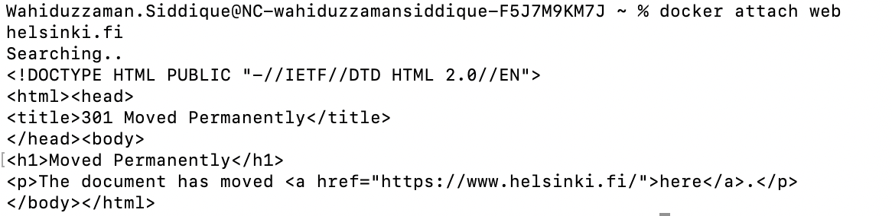

### Used commands:

- To run the ubuntu container in detached mode, I ran the command: 
```console
docker run -d -it --name web ubuntu sh -c 'echo "Input website:"; read website; echo "Searching.."; sleep 1; curl http://$website;'
```
- As curl was not installed, I entered into the container and installed curl with following commands:
```console
docker exec -it web bash
````
```sh
apt update
apt install curl
exit
```

- Finally, attached the running container and tested the input helsinki.fi with following commands

```console
docker attach web
helsinki.fi
```


