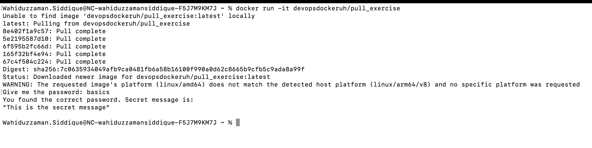

## Solution of task 1.6



### Used commands

```console
docker run -it devopsdockeruh/pull_exercise
```

- Input:

```console
basics
```

## Note:
- Instruction of the exercise is not very clear as to get the expected outcome, one needs to check the index.js file and understand the code since there is no instruction given in either Dockerfile or in Readme file in the source code.
